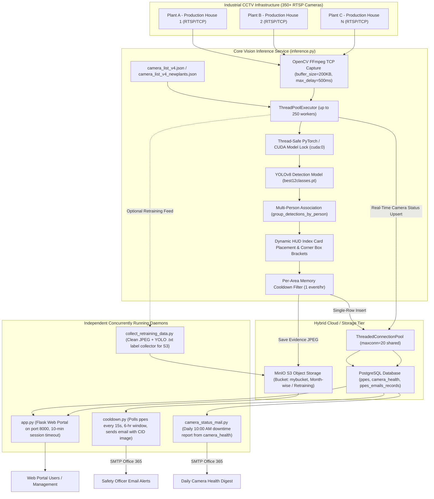

# Knowledge Transfer (KT) Document: Industrial PPE Detection & Safety Monitoring System

**Document Version:** 3.0  
**Project:** Industrial Real-Time PPE Compliance & Multi-Camera Vision Analytics System  
**Location:** `d:\KnowledgeTransfer\PPEsDetection`  
**Classification:** Internal Technical Handover Document  
**Target Environment:** Windows 10/11 & Ubuntu 22.04 LTS (NVIDIA A40 48GB VRAM / Xeon Gold 6326)

---

## 1. Executive Summary & Business Objective

### 1.1 Purpose
The **Industrial PPE Detection & Safety Monitoring System** is an enterprise-grade artificial intelligence and computer vision platform engineered to automate workplace safety enforcement across large-scale industrial manufacturing plants (such as explosive, chemical, and defense manufacturing facilities operated by Solar Industries India Ltd / SIIL). The platform continuously monitors live CCTV camera streams across multiple production houses and identifies worker non-compliance with required Personal Protective Equipment (PPE) regulations in real-time.

### 1.2 Monitored Classes (12-Class Dual Positive & Negative Detection)
The system operates using a custom-trained deep learning vision model (`model/best12classes.pt`) trained to simultaneously detect both **Compliant (Positive)** and **Non-Compliant (Negative)** states across 6 fundamental PPE items:

| Class ID | Model Class Name | Canonical Item | State | Visual Indicator |
|---|---|---|---|---|
| **0** | `Gloves` | Hand Gloves | Compliant (Positive) | Emerald Green Box (`#10B981`) |
| **1** | `Goggles` | Safety Glasses / Goggles | Compliant (Positive) | Emerald Green Box (`#10B981`) |
| **2** | `Helmet` | Hard Hat / Safety Helmet | Compliant (Positive) | Emerald Green Box (`#10B981`) |
| **3** | `Mask` | Respiratory Mask | Compliant (Positive) | Emerald Green Box (`#10B981`) |
| **4** | `No Gloves` | Hand Gloves | **Violation (Negative)** | Alert Crimson Red Box (`#EF4444`) |
| **5** | `No Goggles` | Safety Glasses / Goggles | **Violation (Negative)** | Alert Crimson Red Box (`#EF4444`) |
| **6** | `No Helmet` | Hard Hat / Safety Helmet | **Violation (Negative)** | Alert Crimson Red Box (`#EF4444`) |
| **7** | `No Mask` | Respiratory Mask | **Violation (Negative)** | Alert Crimson Red Box (`#EF4444`) |
| **8** | `No Shoes` | Safety Footwear | **Violation (Negative)** | Alert Crimson Red Box (`#EF4444`) |
| **9** | `No Suit` | Anti-Static / Chemical Suit | **Violation (Negative)** | Alert Crimson Red Box (`#EF4444`) |
| **10** | `Shoes` | Safety Footwear | Compliant (Positive) | Emerald Green Box (`#10B981`) |
| **11** | `Suit` | Anti-Static / Chemical Suit | Compliant (Positive) | Emerald Green Box (`#10B981`) |

---

## 2. System Architecture & High-Concurrency Data Flow



---

## 3. Technology Stack & Key Dependencies

| Component | Library / Framework | Version | Function |
|---|---|---|---|
| **Programming Language** | Python | 3.10+ | Core vision engine, API, and automation daemons |
| **Deep Learning Framework** | PyTorch / CUDA | torch 2.x (CUDA 11.8/12.1) | Accelerating 12-class YOLO neural network inference on GPU |
| **Object Detection** | Ultralytics YOLOv8 | `ultralytics` | Detecting human silhouettes and PPE violation/compliance bounding boxes |
| **Image Processing** | OpenCV | `opencv-python` | High-throughput RTSP decoding, HUD card rendering, tech corner brackets |
| **Object Storage** | MinIO / S3 SDK | `minio`, `boto3` | Enterprise on-premise object storage for snapshot evidence & retraining sets |
| **Relational Database** | PostgreSQL | 14+ | Storing event records, consolidated violation metadata, camera health |
| **DB Pooling & Connectors** | psycopg2 / SQLAlchemy | Latest | Connection pooling (`ThreadedConnectionPool`) with safe leased checkouts |
| **Email Protocol** | smtplib & email.mime | Built-in | Dispatches instant alerts and reports via Office 365 SMTP |
| **Analytics & Visualization** | Pandas & NumPy | Latest | Spatial association algorithms, pivot tables, dashboard metrics |
| **Web Portal** | Flask | 3.x | Role-based dashboard for safety officers and plant management |

---

## 4. Codebase Organization & Key Modules

```
PPEsDetection/
├── .env                              # Credentials (DB passwords, MinIO keys, SMTP secrets)
├── app.py                            # Flask Web Dashboard (port 8000, 10-min session timeout, S3 presigning)
├── auth.py                           # Authentication engine, password hashing, session activity logs
├── camera_list_v4.json               # Primary hierarchical camera definitions (Plant -> House -> Area)
├── camera_list_v4_newplants.json     # Expanded multi-plant camera definitions (350+ endpoints)
├── inference.py                      # [PRIMARY ENGINE] Production 350-camera vision pipeline with pooled DB & HUD
├── collect_retraining_data.py        # Retraining dataset collector (saves clean JPEGs + YOLO .txt to S3)
├── camera_status_mail.py             # Daily 10:00 AM offline camera digest using camera_health table
├── cooldown.py                       # Alert mailer daemon polling ppes table every 15s with 6-hr debounce
├── camera_monitoring.py              # [DEPRECATED] Legacy prober (functionality absorbed into inference.py)
├── ppe_detection_code_working.py     # Legacy 6-class 175-camera script (kept for historical rollback)
├── layouts.py                        # Physical plant area zoning logic
├── model/
│   ├── best12classes.pt              # [ACTIVE] 12-class positive & negative detection model
│   └── best.pt                       # Legacy 6-class negative-only detection model
├── saved_violations/                 # Local disk fallback buffer when S3 is unreachable
├── retraining_dataset/               # Local cache for dataset collection before S3 upload
├── templates/                        # Flask Jinja2 HTML templates for the safety portal
└── static/                           # CSS, JavaScript, and plant branding assets
```

---

## 5. Computer Vision & Machine Learning Pipeline

### 5.1 Model Architecture & Weights
- **Model:** Ultralytics YOLOv8 trained specifically on industrial PPE datasets.
- **Active Weights:** `model/best12classes.pt`.
- **Target Hardware:** NVIDIA GPU (`cuda:0`).
- **Standardized Resolution:** Input frames are processed at $1920 \times 1080$ to maintain consistent pixel geometry.

### 5.2 Granular Class Confidence Thresholds
Each class uses a tuned confidence threshold to maximize detection sensitivity while preventing false alarms:

| Class | Threshold | Rationale |
|---|---|---|
| **`helmet` / `no_helmet`** | **0.80 (80%)** | Prevents false positives caused by dark hair, caps, or varied lighting |
| **`gloves` / `no_glove`** | **0.82 (82%)** | High threshold to prevent bare hands from triggering under skin tones |
| **`shoes` / `no_shoes`** | **0.85 (85%)** | High threshold to distinguish footwear from trousers or equipment edges |
| **`suit` / `no_suit`** | **0.65 (65%)** | Tuned to identify unzipped suits or regular civilian clothing |
| **`goggles` / `no_goggles`** | **0.60 (60%)** | Sensitive threshold due to small relative pixel area of safety glasses |
| **`mask` / `no_mask`** | **0.58 (58%)** | Lower threshold to account for varied worker angles and head positions |
| **Default Fallback** | **0.55 (55%)** | Baseline confidence for unclassified or secondary detections |

### 5.3 Multi-Person Spatial Grouping Algorithm
To determine **Total People** and **Violators Count** from individual body-part detections, `group_detections_by_person(detections)` uses spatial bounding-box association:
1. Detections are sorted vertically from top to bottom (head to feet).
2. Detections are merged into clusters based on horizontal alignment ($|X_{det} - X_{cluster}| \le \text{Threshold}$) and vertical span constraints ($Y_{det} - Y_{cluster\_bottom} \le 1.1 \times \text{Height}$).
3. A cluster is marked as a **Violator** if it contains at least one negative class detection (e.g. `No Helmet`, `No Gloves`).

### 5.4 Visual Evidence & Dynamic HUD Index Card
When a violation occurs, the evidence image is styled before storage:
- **Clean Aesthetic Bounding Boxes:** Rendered with corner focus brackets without cluttering percentage text or floating labels. Compliant boxes are Emerald Green; violations are Alert Crimson Red.
- **Glassmorphic Translucent HUD Card:** A compact $470 \times 220$ px overlay with alpha transparency ($0.65$) displaying:
  - Header: Production House, Monitored Zone, Date, Time.
  - KPI Metrics: Total People, Violators Count, Violations Count, Compliances Count.
  - Live Area PPE Status Chips: Mandatory PPEs for the zone with live indicators:
    - `[!] Item` (Red): Violation detected in area.
    - `[OK] Item` (Green): Compliance verified.
    - `[-] Item` (Gray): Required in zone, not detected on current visible workers.
- **Anti-Obstruction Placement (`get_optimal_overlay_position`):** The algorithm tests 4 candidate corners (top-right, top-left, bottom-right, bottom-left) against all detected worker bounding boxes. The corner with the lowest intersection area is selected, **guaranteeing the worker is never obscured behind the HUD card**.

---

## 6. High-Concurrency Stream Ingestion & Network Engineering

### 6.1 Concurrency Model (`inference.py`)
Handling 350+ camera streams simultaneously without packet drops or thread thrashing requires specific concurrency tuning:
- **Worker Allocation:** `ThreadPoolExecutor(max_workers=min(250, total_cameras))`. Workers are capped at 250 to prevent OS context-switching degradation.
- **RTSP TCP Optimization:** Enforces TCP transport and aggressive drop policies for stale network packets:
  ```python
  os.environ["OPENCV_FFMPEG_CAPTURE_OPTIONS"] = "rtsp_transport;tcp|stimeout;4000000|buffer_size;204800|max_delay;500000"
  ```
- **1-Frame Internal Buffer (`CAP_PROP_BUFFERSIZE = 1`):** OpenCV is instructed to keep only the latest frame, preventing buffer bloat.
- **Staggered Polling:** Cameras check frames on a 60-second interval, staggering load across the GPU and network switches.

### 6.2 Absorption of `camera_monitoring.py` into `inference.py`
Previously, `camera_monitoring.py` ran as a separate process opening a second simultaneous RTSP stream to all 350 cameras, causing:
1. Dual-stream connection drops on camera DSP encoders.
2. Network saturation across plant switches (700 simultaneous RTSP streams).
3. Database `ACCESS EXCLUSIVE` table lock deadlocks due to `TRUNCATE TABLE camera_health`.

**Current Implementation:**
`inference.py` now directly maintains `camera_health` via [update_camera_status()](file:///d:/KnowledgeTransfer/PPEsDetection/inference.py):
- When a stream connects or drops, it executes an atomic PostgreSQL `UPSERT`:
  ```sql
  INSERT INTO camera_health (camera_id, plant, production_house, area, rtsp_link, status, last_checked)
  VALUES (%s, %s, %s, %s, %s, %s, %s)
  ON CONFLICT (camera_id) DO UPDATE SET
      status = EXCLUDED.status,
      last_checked = EXCLUDED.last_checked,
      rtsp_link = EXCLUDED.rtsp_link,
      plant = EXCLUDED.plant,
      production_house = EXCLUDED.production_house,
      area = EXCLUDED.area;
  ```
- Uses an edge-triggering in-memory cache with a 5-minute heartbeat to suppress redundant database writes.
- **`camera_monitoring.py` is no longer needed and should not be run.**

---

## 7. Retraining Dataset Collection Pipeline (`collect_retraining_data.py`)

To continuously improve model accuracy and eliminate false positives, a dedicated dataset collector runs over 2–3 days:
- **Zero HUD Watermarking:** Saves pristine, unmodified 1080p JPEG images.
- **YOLO Label Format:** Generates normalized `.txt` annotation files:
  ```
  <class_id> <x_center> <y_center> <width> <height>
  ```
- **Automatic Manifest Generation:** Automatically produces `data.yaml` and `classes.txt` matching Ultralytics YOLO training standards.
- **Dual Storage:** Saves locally to `retraining_dataset/` and uploads to S3 under `retraining_dataset/{month}/`.

---

## 8. Database Schema Specifications (PostgreSQL)

### 8.1 Table: `ppes`
Primary operational table capturing all detected violation events. **Exactly ONE row is inserted per violation event image.**

| Column | Type | Constraints | Description |
|---|---|---|---|
| `id` | `SERIAL` | Primary Key | Unique violation transaction ID |
| `class1` | `TEXT` | Not Null | Consolidated violation classes string (e.g. `No Helmet, No Gloves`) |
| `production_house` | `TEXT` | Not Null | Production house identifier (e.g. `PP-01`, `CBH3`) |
| `camera_unit` | `TEXT` | Nullable | Camera IP address or stream ID |
| `date1` | `DATE` | Not Null | Date of violation occurrence |
| `time1` | `TIME` | Not Null | Time of violation occurrence |
| `image_url` | `TEXT` | Not Null | Public / S3 link to annotated violation screenshot |
| `area` | `TEXT` | Nullable | Specific monitored zone / area type |
| `camera_status` | `BOOLEAN` | Default `True` | Live stream operational status |
| `violation` | `BOOLEAN` | Default `True` | Flag indicating non-compliance |
| `violations` | `TEXT` | Nullable | Comma-separated list of detected violation classes |
| `compliance` | `TEXT` | Nullable | Comma-separated list of detected compliant classes |
| `violation_count` | `INTEGER` | Default `0` | Total number of non-compliant PPE items detected |
| `compliance_count` | `INTEGER` | Default `0` | Total number of compliant PPE items detected |
| `people_count` | `INTEGER` | Default `0` | Total worker silhouettes identified in frame |
| `violator_count` | `INTEGER` | Default `0` | Number of workers violating safety policies |
| `required_ppes` | `TEXT` | Nullable | Comma-separated list of mandatory PPEs for this area |

### 8.2 Table: `camera_health`
Populated automatically by `inference.py` for infrastructure monitoring and offline alerts.

| Column | Type | Constraints | Description |
|---|---|---|---|
| `camera_id` | `TEXT` | Primary Key | Composite key (`{plant}_{production_house}_{area}`) |
| `plant` | `TEXT` | Not Null | Manufacturing plant name |
| `production_house` | `TEXT` | Not Null | Production building code |
| `area` | `TEXT` | Not Null | Monitored zone |
| `rtsp_link` | `TEXT` | Not Null | RTSP stream URI |
| `status` | `BOOLEAN` | Not Null | `True` if online, `False` if unreachable |
| `last_checked` | `TIMESTAMP` | Not Null | Last successful probe timestamp |

### 8.3 Table: `ppes_emails_records`
Audit log of all violation email alerts dispatched by `cooldown.py`.

| Column | Type | Constraints | Description |
|---|---|---|---|
| `id` | `SERIAL` | Primary Key | Unique alert notification ID |
| `class_label` | `TEXT` | Not Null | Violation class label(s) |
| `production_house` | `TEXT` | Not Null | Production building code |
| `area` | `TEXT` | Not Null | Monitored zone |
| `to_recipients` | `TEXT` | Not Null | Comma-separated email recipients (TO) |
| `cc_recipients` | `TEXT` | Nullable | Comma-separated email recipients (CC) |
| `insert_date` | `DATE` | Not Null | Date alert was dispatched |
| `insert_time` | `TIME` | Not Null | Time alert was dispatched |

---

## 9. Environment Variables (`.env`)

```ini
# PostgreSQL Database Credentials
DB_HOST=localhost
DB_USER=ppes_admin
DB_PASS=Pg@99eS!!L@2025ag
DB_PASS_ENC=Pg%4099eS!!L%402025ag
DB_PORT=5432
DB_NAME=ppes

# MinIO / S3 Object Storage Configuration
BUCKET_NAME=mybucket
S3_ENDPOINT_URL=https://ppes-siil.solargroup.com:9000
INTERNAL_S3_ENDPOINT_URL=https://127.0.0.1:9000
AWS_ACCESS_KEY_ID=admin
AWS_SECRET_ACCESS_KEY="V!S!ON#c2026@@"

# Office 365 Corporate Email Server
SENDER_EMAIL=iiot@solargroup.com
SMTP_EMAIL=iiot@solargroup.com
SMTP_SERVER=smtp.office365.com
SMTP_PORT=587
SMTP_USERNAME=iiot@solargroup.com
SMTP_PASSWORD=your-app-password

# Application Settings
SECRET_KEY="sdhgfshjdgahjhquerqhjdc655sdf3fanddjhhabfj26q79ffwj4"
TEST_MODE=False
HOST=ppes-siil.solargroup.com
MODEL_PATH=model/best12classes.pt
```

---

## 10. Operational Runbook & Multi-Service Deployment Guide

### 10.1 Running the Active Production Services Concurrently
In standard operation, **four** concurrent services should be active:

| Service | Command | Role |
|---|---|---|
| **Vision Inference** | `python inference.py` | 350-camera YOLO detection, S3 uploads, single-row DB logging, `camera_health` updates |
| **Web Dashboard** | `python app.py` | Flask Web Portal on port 8000 |
| **Alert Mailer** | `python cooldown.py` | Checks `ppes` every 15s, enforces 6-hr cooldown, sends inline CID image emails |
| **Camera Health Digest** | `python camera_status_mail.py` | Sends daily 10:00 AM offline camera digest to network engineers |

> [!CAUTION]
> **Do NOT run [camera_monitoring.py](file:///d:/KnowledgeTransfer/PPEsDetection/camera_monitoring.py)** simultaneously with [inference.py](file:///d:/KnowledgeTransfer/PPEsDetection/inference.py). It creates duplicate RTSP connections to the same cameras, causing stream drops and network packet loss.

### 10.2 Production Deployment via `systemd` (Linux Ubuntu)
On the production server, manage these services as background daemons:

#### 1. Vision Engine (`/etc/systemd/system/ppe-inference.service`)
```ini
[Unit]
Description=PPE Vision Inference Engine
After=network.target postgresql.service

[Service]
Type=simple
User=administrator
WorkingDirectory=/home/administrator/PPEsDetection
ExecStart=/home/administrator/PPEsDetection/venv/bin/python inference.py --cameras camera_list_v4_newplants.json --model model/best12classes.pt
Restart=always
RestartSec=10

[Install]
WantedBy=multi-user.target
```

#### 2. Alert Mailer (`/etc/systemd/system/ppe-cooldown.service`)
```ini
[Unit]
Description=PPE Cooldown Alert Mailer Daemon
After=network.target postgresql.service

[Service]
Type=simple
User=administrator
WorkingDirectory=/home/administrator/PPEsDetection
ExecStart=/home/administrator/PPEsDetection/venv/bin/python cooldown.py
Restart=always
RestartSec=15

[Install]
WantedBy=multi-user.target
```

#### 3. Web Dashboard (`/etc/systemd/system/ppe-dashboard.service`)
```ini
[Unit]
Description=PPE Safety Management Web Portal
After=network.target postgresql.service

[Service]
Type=simple
User=administrator
WorkingDirectory=/home/administrator/PPEsDetection
ExecStart=/home/administrator/PPEsDetection/venv/bin/python app.py
Restart=always
RestartSec=10

[Install]
WantedBy=multi-user.target
```

#### 4. Camera Status Mailer (`/etc/systemd/system/ppe-health-mail.service`)
```ini
[Unit]
Description=PPE Daily Camera Health Mailer
After=network.target postgresql.service

[Service]
Type=simple
User=administrator
WorkingDirectory=/home/administrator/PPEsDetection
ExecStart=/home/administrator/PPEsDetection/venv/bin/python camera_status_mail.py
Restart=always
RestartSec=30

[Install]
WantedBy=multi-user.target
```

### 10.3 Solar Group Smart Factory UI & Diagnostics Architecture
- **Smart Factory Design System (SKILL.md):** Fully migrated UI to the Solar Group Smart Factory design system:
  - **Typeface:** 100% Montserrat (Weights 400, 500, 700 ONLY).
  - **Strict Sentence Case:** Zero uppercase micro-labels or screaming headers.
  - **Color Discipline:** Solar Red (`#ed1c24` / `#d31017`) restricted strictly to the 2px structural cap rule (`.panel-brand`), eyebrow accent ticks (`.eyebrow-accent`), and at most one primary CTA button (`.btn-primary-smart`). Trust Blue (`#1a2d5e`, `#1f3f80`, `#c7e0f3` powder blue) carries all navigation and wayfinding.
  - **Depth & Surfaces:** 22px technical modular grid canvas (`.grid-field`) at 2.8% opacity with crisp 1px hairlines (`#e6e8ea`) and soft honest shadows.
  - **Unboxed Floating Logo:** Free-floating, transparently framed corporate mark (`/static/logo.png`) adhering to 1x clear space rules without artificial card containers.
- **Offline Cameras Diagnostics Module (Resolving Rose Chart Anti-Pattern):**
  - **Ranked Horizontal Bar Chart:** Aggregates offline cameras by `production_house` in descending order, immediately highlighting network switch or PDU cluster disruptions with exact counts and downtime percentages.
  - **Searchable Offline Camera Directory:** Companion roster with real-time text filter (`production_house`, `area`, `plant`), production house pills, and offline status tags for field technician dispatch.
- **Clean 6-Class Decomposition:** Multi-violation strings (e.g. `No Helmet, No Gloves`) are decomposed into individual canonical categories (`No Helmet`, `No Gloves`, `No Shoes`, `No Suit`, `No Goggles`, `No Mask`). Compliant classes are filtered out, producing an uncluttered, single-slice-per-class donut distribution chart with dedicated legends and percentage callouts.
- **Multi-Class Filter Matching:** Dashboard sidebar class filters accurately match records containing any selected violation class, even within multi-violation records.

---

## 11. Database Indexing & Maintenance Guardrails

### 11.1 Recommended Database Indexes
To maintain fast dashboard filtering and mailer queries when `ppes` exceeds 100,000 rows:
```sql
CREATE INDEX IF NOT EXISTS idx_ppes_date_violation ON ppes (date1, violation);
CREATE INDEX IF NOT EXISTS idx_ppes_area_ph ON ppes (production_house, area);
CREATE INDEX IF NOT EXISTS idx_ppes_order_id ON ppes (id DESC);
CREATE INDEX IF NOT EXISTS idx_camera_health_status ON camera_health (status);
```

### 11.2 Storage Lifecycle & Image Retention
With 350 cameras logging violation events, image evidence in MinIO will grow over time.
- **Recommended Lifecycle Rule:** Set a MinIO bucket lifecycle expiration of **180 days** for `mybucket` to archive or purge older snapshots.
- **Retraining Data Protection:** Ensure the `retraining_dataset/` prefix is excluded from automatic purging rules.
